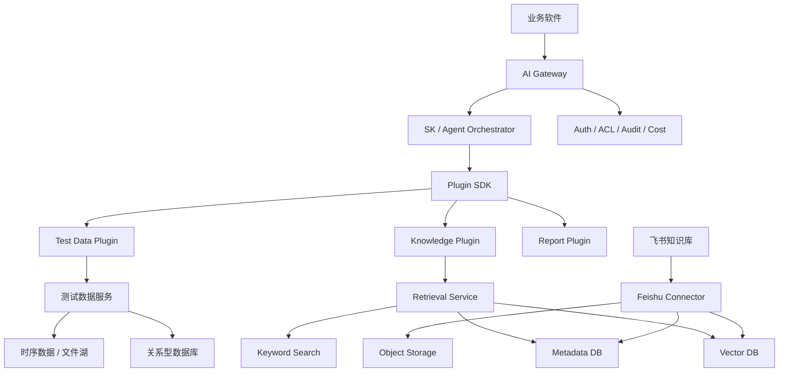

# 整体架构

## 1. 架构原则

1. AI 模块与吉利测试软件业务代码解耦。
2. 业务系统通过 API / gRPC / OpenAPI / MCP 暴露能力。
3. SK 只做编排，不直接管理所有业务数据。
4. 飞书是权威知识源，不是最终检索层。
5. 向量检索和精确数据查询分开。
6. 所有工具调用都有权限、超时、审计和风险等级。
7. 先做只读能力，后做写入能力。
8. 客户交付形态必须支持替换模型 API、知识源配置和业务 Plugin。
9. 在拿不到客户源码时，优先采用外置服务、文件适配器和稳定契约，不做猜测式内部集成。

## 2. 产品化交付边界

这个方向是对的，但需要把“公司可复用框架”和“客户项目集成件”分清楚。

建议分成三层：

| 层级 | 内容 | 是否跟随客户软件交付 | 是否公司复用 |
| --- | --- | --- | --- |
| AI Runtime | AI Gateway、SK 编排、RAG 查询、Plugin 执行、审计、配置加载 | 是 | 是 |
| Connector Pack | 飞书、文件夹、SharePoint、数据库等知识源 Connector | 按客户环境选择交付 | 是 |
| Project Plugins | 吉利测试数据 API、报告模板、业务函数、UI 组件配置 | 是 | 部分复用 |

客户侧应该可以替换：

- 大模型 API Key 和 Base URL。
- Embedding 模型。
- 向量库连接。
- 飞书应用凭据或其他知识源凭据。
- 业务系统 API 地址。
- 是否启用联网模型、私有化模型或内网模型网关。

公司侧需要长期沉淀：

- Plugin SDK。
- RAG 索引和检索协议。
- 文档标准化协议。
- 权限和审计模型。
- 动态 UI Schema 协议。
- 评测集和质量门禁。

白话解释：交付给客户的不是你们公司内部那套固定服务，而是一套可以嵌进客户软件里的 AI 模块。客户换模型、换 API、换知识库地址时，只改配置和 Connector，不改核心框架。

## 3. 无源码集成架构

```text
客户测试软件
  -> 公开 HTTP API / OpenAPI
  -> AI Gateway

客户测试软件
  -> 导出 PDX / JSON / CSV / Excel / XML / 报告文件
  -> TestDataFileAdapter
  -> AI Gateway

飞书知识库
  -> lark-cli
  -> FeishuCliProvider
  -> AI Gateway
```

MVP 只要求客户提供以下一种能力：

1. 只读 HTTP API。
2. 只读 CLI。
3. 固定格式文件导出，例如 PDX、JSON、CSV、Excel、XML。

如果客户暂时无法提供接口，项目内先使用 Mock Host 或 JSON fixture，等接口确认后替换 Base URL、CLI 命令或文件 Adapter。

## 4. 逻辑分层



## 5. 服务边界

### AI Gateway

职责：

- 统一入口。
- 校验用户身份和项目上下文。
- 创建 `request_id`。
- 调用 SK。
- 返回引用和结构化结果。

不负责：

- 直接解析飞书文档。
- 直接连接业务数据库。
- 直接执行未注册的函数。

### Feishu Sync Worker

职责：

- 飞书节点枚举。
- 文档内容读取。
- 内容标准化。
- 版本识别。
- ACL 同步。
- 索引任务投递。

### Retrieval Service

职责：

- Query Rewrite。
- 权限过滤。
- 向量检索。
- 关键词检索。
- Rerank。
- 引用信息拼装。

### Test Data Service

职责：

- 提供确定性的测试数据查询和分析接口。
- 不接受模型生成的任意 SQL。
- 对数据查询做项目、用户和时间范围校验。

## 6. 推荐部署

MVP 可以采用以下部署：

```text
ai-gateway             ASP.NET Core / 外置服务
feishu-cli-provider    Python Worker / Connector
test-data-adapter      客户 HTTP API、Mock Host 或测试文件解析器
model-api              客户可配置的模型网关
```

不要一开始拆成过多微服务。MVP 先把 AI Gateway、Feishu CLI Provider 和测试数据 Adapter 跑通。

PostgreSQL、Qdrant、Redis 和 MinIO 属于后续 IndexedRagProvider 的部署组件。

## 7. 数据流

### MVP 知识查询

```text
User Question
  -> FeishuCliProvider.search
  -> FeishuCliProvider.fetch
  -> Normalized Document
  -> SK Context
  -> Answer + Feishu Citation
```

### MVP 数据分析

```text
User Question
  -> TestDataPlugin
  -> Customer API / Mock Host / TestDataFileAdapter
  -> Structured Test Result
  -> SK Explanation
  -> Answer + Data Source + Audit ID
```

## 8. 数据库原则

向量库只保存向量和必要检索字段。原文、权限、版本、索引任务和来源信息放在关系型数据库或对象存储。

测试数据不进入向量库的主数据路径。模型需要分析测试数据时，调用 `TestDataPlugin` 获取结构化结果。
