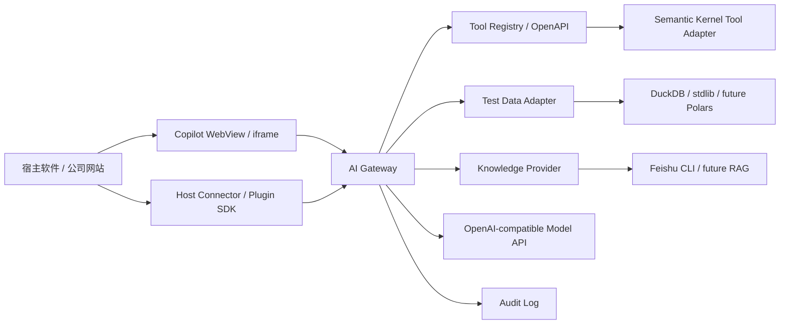

# 可复用 AI 插件完整开发计划

## 1. 📌 当前结论

Geely AI Platform 的产品定位调整为：

```text
可复用 AI 插件底座
  -> 可嵌入 Copilot 前端
  -> AI Gateway 后端契约
  -> Host Connector / Plugin SDK
  -> Tool Registry / OpenAPI / Plugin Manifest
  -> 测试数据分析 Adapter
  -> 后续接 Semantic Kernel / RAG / AG-UI
```

不要继续把项目做成一堆自研小功能。现有 AI Gateway 继续保留，作为后端契约和业务 Adapter；前端 Copilot 插件、Agent UI、动态交互尽量复用成熟开源项目。

白话备注：我们自己做“AI 插件底座”和“业务接线”，不要自己从 0 写完整 Copilot 框架、Chat UI 框架、RAG 平台和低代码平台。

## 2. 🎯 产品目标

第一版要展示的是一个可嵌入、可替换模型、可复用到其他软件的 AI 插件产品。

目标效果：

```text
客户测试软件 / 公司网站
  -> WebView / iframe 嵌入 Copilot 插件
  -> Host SDK 写入当前项目、Run、测试文件路径
  -> Copilot 调用 AI Gateway
  -> Gateway 调用数据分析、知识检索、模型 API
  -> 返回结构化结果、引用、request_id
```

对客户来说，交付物应该像这样：

- 一个能启动的 AI Gateway。
- 一个能嵌入的软件侧边 Copilot。
- 一套 HTTP / OpenAPI / Plugin Manifest 契约。
- 一套 Host SDK 样例。
- 一套配置和验收脚本。
- 一套清楚的只读安全边界。

## 3. 🧭 总体架构



模块职责：

| 模块 | 当前职责 | 后续演进 |
| --- | --- | --- |
| Copilot 前端 | assistant-ui 提供对话线程，Fluent UI 提供侧边栏产品外壳 | 通过 External Store Runtime 对接稳定 Gateway REST API |
| AI Gateway | 暴露稳定 HTTP 契约、统一错误、审计、配置 | 通过 Semantic Kernel 编排只读 REST 工具 |
| Host SDK | 宿主传上下文、调用分析接口 | 扩展 C# / Java / C++ SDK |
| TestDataAdapter | 解析 JSON / CSV，输出标准模型 | 接 Excel、PDX 官方工具或 SDK |
| KnowledgeProvider | 当前返回飞书演示引用 | 接 lark-cli，再决定是否索引 RAG |
| Tool Registry | 描述 Agent 可调用工具 | 映射 SK Function / MAF Tool / AG-UI Tool |
| Delivery Scripts | 客户启动和检查 | 后续做安装包或服务注册 |

## 4. ✅ 已完成基线

当前已经完成：

| 编号 | 能力 | 状态 |
| --- | --- | --- |
| P0-001 | Feishu CLI Provider 方向 | 暂停，飞书不做全量迁移 |
| P0-002 | `TestDataFileAdapter` 契约 | Done |
| P0-003 | JSON fixture / CSV 解析 | Done |
| P0-004 | `get_test_run_summary` | Done |
| P0-005 | `compare_test_runs` | Done |
| P0-006 | 模型 API 配置 | Done |
| P0-007 | AI Gateway 查询接口 | Done |
| P0-008 | MVP 评测和审计 | Done |
| P0-009 | Host Context 接入契约 | Done |
| P0-010 | 最小 Audit Log | Done |
| P0-011 | Tool Registry 契约 | Done |
| P0-012 | 宿主集成 Demo 包 | Done |
| P0-013 | 产品展示前端 | Done |
| P0-014 | 可复用 Copilot Shell | Done |
| P0-015 | 测试数据洞察接口 | Done |
| P0-016 | Host Connector / Plugin SDK 样例 | Done |
| P0-017 | 客户部署配置最小化 | Done |
| P0-018 | 开源 Copilot 插件底座 | Done：React + assistant-ui + Fluent UI 已构建并由 Gateway 提供 |
| P0-019 | 宿主嵌入与会话契约 | Done：会话隔离、`postMessage`、Host Asset 和 SDK 已验证 |
| P0-020 | 演示交付包 | Done：Gateway、独立前端和双 URL 检查脚本已验证 |
| P1-003 | Feishu CLI Provider | Done：真实搜索、关键词原文读取和 Gateway 引用已验证 |

当前可运行入口：

```text
http://127.0.0.1:8765/showcase
http://127.0.0.1:8765/copilot-shell/
```

## 5. 🧩 开源项目选型

### 5.1 Copilot 前端层

| 项目 | 适合做什么 | 结论 |
| --- | --- | --- |
| CopilotKit | in-app Copilot、Generative UI、人机协同、Agent 前端 | 已完成 Spike；需要独立 Runtime / 云许可，不适合直接对接当前 Gateway REST 契约 |
| assistant-ui | React Chat UI、tool rendering、流式消息、附件 | 当前采用；External Store Runtime 可直接承接 Gateway 状态和请求 |
| AG-UI | Agent 和 UI 的事件协议 | 后续协议层，不先强上 |

选择原则：

- 当前固定使用 assistant-ui，不同时保留 CopilotKit 依赖。
- Fluent UI 负责侧边栏布局、宿主上下文和快捷操作，assistant-ui 负责线程、消息、Composer 和 Markdown。
- AG-UI 先作为后端协议目标，不在 P0 阶段强制实现。

### 5.2 Agent 编排层

| 项目 | 适合做什么 | 结论 |
| --- | --- | --- |
| Semantic Kernel | Plugin / Function Calling / 企业应用编排 | P1-007 采用，映射现有 REST Tool Registry |
| Microsoft Agent Framework | 多 Agent / 复杂工作流运行时 | 当前不引入；出现明确多 Agent 或长流程需求后再评估兼容 |

当前采用 Semantic Kernel 而不采用 Microsoft Agent Framework 的原因：

- 现有 REST / Tool Registry 已稳定，适合直接映射为 SK Plugin / Function。
- 当前需要的是单 Agent 的函数选择和调用，不需要多 Agent、长流程状态或复杂运行时。
- Gateway REST API 保持框架无关；以后更换编排框架不影响宿主网站和桌面软件。
- Python `semantic-kernel` 固定为可选依赖，基础 Gateway 不因编排层增加部署负担。

### 5.3 RAG 和数据分析层

| 项目 | 用途 | 采用时机 |
| --- | --- | --- |
| DuckDB | CSV / JSON / Parquet 本地 SQL 分析 | 已做可选引擎 |
| Polars / Pandas | DataFrame 分析 | P1，客户数据复杂后再接 |
| LlamaIndex / Haystack | RAG pipeline | P1，飞书知识查询确定后再选 |
| LanceDB / Qdrant / PGVector | 向量检索 | P1，不作为 MVP 必需 |
| Dify / Flowise | 低代码 AI 工作流参考 | 只做参考或 PoC，不作为核心插件底座 |
| Great Expectations / Evidently | 数据质量和漂移分析 | P1，测试指标规则明确后接 |

## 6. 🛠️ 开发顺序规则

以后每个任务必须按这个顺序做：

```text
1. 写清本任务计划
2. 明确采用或不采用哪些开源项目
3. 明确验收标准
4. 实现最小代码
5. 跑测试和产品检查
6. 同步 D 盘、CodeGraph、GitHub
```

任务只有在用户可以打开并使用最终产品入口、自动化验收通过后才算完成。Spike、占位页面、临时手写 UI 和“以后再替换”的实现不能标记为 Done。

不允许：

- 先写代码，最后补文档解释。
- 为了“以后可能用”添加抽象。
- 同时引入多个大框架。
- 把 CopilotKit、assistant-ui、Dify、SK 一起塞进来。
- 在已有成熟组件时继续手写聊天消息、线程、Markdown、工具状态、按钮和设计系统。
- 为了先过测试提交一个后续必须整体删除的产品实现。
- 在没有真实 PDX 样例时猜 PDX 格式。
- 让 AI 直接写客户系统、测试配置或设备控制。

## 7. 🚧 下一阶段路线

### P0-018：开源 Copilot 插件底座产品化

目标：交付用户可以直接打开、嵌入和操作的侧边栏 Copilot。当前手写 HTML/CSS/DOM 只作为接线路径验证，不作为最终实现保留。

已确定技术方案：

```text
frontend/copilot-shell
  -> React + TypeScript + Vite
  -> assistant-ui 现成 Thread / Message / Composer / Markdown
  -> Microsoft Fluent UI / Fluent Icons
  -> gatewayClient 调用稳定 AI Gateway REST API
  -> Vite dist 输出，由 Gateway 提供 iframe / WebView 页面
```

开源边界：assistant-ui、Fluent UI、React 和 Vite 使用固定版本；不同时引入 CopilotKit。业务代码只负责宿主上下文、Gateway Adapter 和测试数据结果展示，不重写开源项目已有的线程、消息、Composer 和 Markdown 能力。

验收标准：

- `frontend/copilot-shell` 是可安装、可构建的 React TypeScript 项目。
- UI 实际引用 assistant-ui 和 Fluent UI，不接受仅在 README 中写“以后接入”。
- `pnpm build` 生成可部署产物，Gateway 直接提供 `/copilot-shell/`。
- 页面具备 Microsoft Copilot 风格侧边栏、消息区、快捷操作、上下文状态、加载状态和错误 `request_id` 展示。
- 所有 Gateway 调用集中在 TypeScript `gatewayClient`，组件中不散落裸 `fetch`。
- 能调用：
  - `/api/v1/host/context`
  - `/api/v1/agent/query`
  - `/api/v1/test-data/insights`
  - `/api/v1/test-data/compare`
- `/showcase` 实际嵌入构建后的 Copilot，不接受“提供替换路径”代替完成。
- Gateway 单测、eval、前端构建和部署检查全部通过。
- 不删除现有 Gateway API。

非目标：

- 不做完整设计系统。
- 不做动态 UI。
- 不做多 Agent。
- 不接真实飞书。
- 不做 RAG 索引。

### P0-019：宿主嵌入与会话契约

目标：让同一 Copilot 可以安全地服务网站 iframe 和桌面 WebView，而不是共享一个进程级全局上下文。

验收标准：

- Host 创建 `host_session_id`，上下文按会话隔离。
- 网站和桌面宿主通过 `postMessage` 或 Host SDK 更新当前会话上下文。
- 浏览器不直接依赖服务端本地绝对路径；数据通过 `asset_id`、Connector 或桌面 Sidecar 解析。
- 保留现有 REST 工具接口，新增契约不破坏 Host SDK。

### P0-020：演示交付包

目标：让内部演示人员能一键启动 Gateway 和 Copilot 前端。

验收标准：

- 一个脚本启动 Gateway。
- 一个脚本启动 Copilot 前端。
- 检查脚本验证 Gateway 和前端 URL。
- 文档说明客户如何嵌入。

## 8. 📊 P1 路线

| 编号 | 任务 | 触发条件 | 验收标准 |
| --- | --- | --- | --- |
| P1-001 | PDX 工具链调研 | 拿到脱敏 PDX 样例或官方说明 | 找到官方工具、SDK、CLI 或确认无法解析 |
| P1-002 | PDX Adapter | PDX 格式明确 | 能解析脱敏样例并输出 TestRunSummary |
| P1-003 | Feishu CLI Provider | 需要真实知识查询 | 可读取有权限飞书文档并返回引用 |
| P1-004 | Indexed RAG Provider | 飞书 CLI 查询性能不足 | 支持 LanceDB / Qdrant / PGVector 之一 |
| P1-005 | 数据质量规则 | 测试规则明确 | 接 Great Expectations 或轻量规则引擎 |
| P1-006 | 数据画像报告 | 需要一键数据概览 | 接 ydata-profiling 或同类工具 |
| P1-007 | Semantic Kernel Tool Adapter | 工具契约稳定 | Copilot 问题经 SK 选择只读 REST 工具，Gateway 执行后返回结果、引用和调用记录 |

## 9. 🔒 安全边界

P0 和 P1 默认只读。

禁止：

- 修改客户数据库。
- 修改测试配置。
- 控制测试设备。
- 删除或上传客户测试文件。
- 将客户真实数据提交到 GitHub。
- 在日志或响应中输出 API Key。
- 让 LLM 直接生成并执行宿主软件插件代码。

需要二次确认后才能进入后续阶段：

- 写入类工具。
- 自动生成正式 UI 模块。
- 自动修改测试流程。
- Text-to-SQL 查询客户生产数据库。
- 长期存储客户知识库向量。

## 10. 🧪 固定验收命令

Gateway 单测：

```powershell
cd D:\geely-ai-platform\src\ai-gateway
$env:PYTHONPATH='src'
python -m unittest discover -s tests -p "test_*.py"
```

Gateway eval：

```powershell
cd D:\geely-ai-platform\src\ai-gateway
python evals\run_eval.py
```

Host SDK 测试：

```powershell
cd D:\geely-ai-platform\samples\host-integration
python -m unittest discover -s . -p "test_python_host_sdk.py"
```

部署检查：

```powershell
cd D:\geely-ai-platform
powershell -NoProfile -ExecutionPolicy Bypass -File .\scripts\check-ai-gateway.ps1 -GatewayUrl http://127.0.0.1:8783
```

## 11. 🔁 换对话接手规则

新对话或新 AI 接手时，先读：

1. `AGENTS.md`
2. `docs/13-reusable-ai-plugin-development-plan.md`
3. `docs/04-development-guide.md`
4. `README.md`

接手后先确认：

- 当前最新 Git commit。
- `D:\geely-ai-platform` 是否干净。
- `http://127.0.0.1:8765/showcase` 是否仍可用。
- 当前任务编号是什么。

默认下一步：

```text
P1-007：Semantic Kernel Tool Adapter
```

P1-001 / P1-002 等待脱敏 PDX 样例或官方工具说明；P1-004 只在 CLI 查询性能不足时启动，P1-005 / P1-006 等待真实规则或画像需求。在此之前优先把稳定的 REST Tool Registry 接入成熟 Agent 框架。

P1-007 验收标准：

- `/api/v1/tools` 中的只读工具动态映射为 Semantic Kernel OpenAPI Plugin，不复制分析、飞书或 Host 业务逻辑。
- Copilot 自由文本通过 `/api/v1/agent/query` 进入编排链路，快捷确定性操作继续直接调用稳定 REST API。
- 配置 OpenAI-compatible 模型时由 Semantic Kernel 自动选择并调用工具；未配置模型时使用确定性选择器保证离线演示和测试。
- 响应包含 `answer`、`citations`、`request_id`、`tool_calls` 和编排模式，工具调用继续进入 Gateway Audit Log。
- `semantic-kernel` 固定版本并作为可选依赖；不安装 Microsoft Agent Framework，不改变现有 REST 工具契约。

除非用户明确改变方向，否则不要回到“继续手写 HTML 小功能”的路线。

## 12. 🔗 参考链接

- CopilotKit：https://github.com/CopilotKit/CopilotKit
- CopilotKit Docs：https://docs.copilotkit.ai/
- assistant-ui：https://github.com/assistant-ui/assistant-ui
- assistant-ui Docs：https://www.assistant-ui.com/
- AG-UI：https://github.com/ag-ui-protocol/ag-ui
- Semantic Kernel：https://github.com/microsoft/semantic-kernel
- Microsoft Agent Framework Docs：https://learn.microsoft.com/semantic-kernel/frameworks/agent/?pivots=programming-language-csharp
- Dify：https://github.com/langgenius/dify
- Flowise：https://github.com/FlowiseAI/Flowise
- LlamaIndex：https://github.com/run-llama/llama_index
- Haystack：https://github.com/deepset-ai/haystack
- LanceDB：https://github.com/lancedb/lancedb
- Qdrant：https://github.com/qdrant/qdrant
